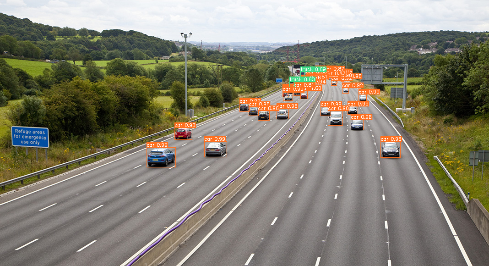
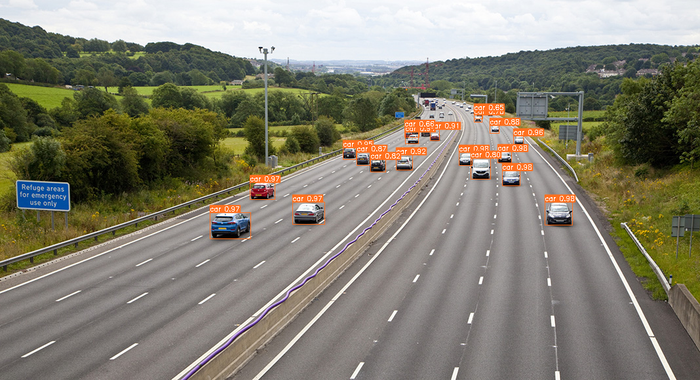

<div align="center">
<h1>
  SAHIDET2: SAHI Kullanarak Yüksek Doğruluklu Nesne Tespit Uygulaması Yap!
</h1>
<h4>
    
</h4>
</div>

1. Kütüphanelerin Yüklenmesi:
```
pip install -U git+https://github.com/obss/sahi.git
pip install detectron2 -f https://dl.fbaipublicfiles.com/detectron2/wheels/cpu/torch1.10/index.html # for Detectron2-cpu
#pip install detectron2 -f https://dl.fbaipublicfiles.com/detectron2/wheels/cu111/torch1.10/index.html # for Detectron2-cuda11.1
```

2. Kütüphanelerin Import Edilmesi:
```
from sahi.utils.detectron2 import Detectron2TestConstants
from sahi.model import Detectron2DetectionModel
from sahi.predict import get_sliced_prediction, predict, get_prediction
from sahi.utils.file import download_from_url
from sahi.utils.cv import read_image
from IPython.display import Image
```
3. Model ve Test Resimlerinin Yüklenmesi:

```
model_path = download_from_url(
    "https://dl.fbaipublicfiles.com/detectron2/COCO-Detection/faster_rcnn_R_50_FPN_3x/137849458/model_final_280758.pkl",
    "model_final_280758.pkl")

image = download_from_url('https://raw.githubusercontent.com/obss/sahi/main/demo/demo_data/small-vehicles1.jpeg',
                  'demo_data/small-vehicles1.jpeg')
```

4. Cfg Dosyasının Yüklenmesi:
```
cfg = get_cfg()
cfg.MODEL.ROI_HEADS.NUM_CLASSES = 445
cfg.MODEL.ROI_HEADS.SCORE_THRESH_TEST = 0.2
config_path = export_cfg_as_yaml(cfg, export_path='config.yaml')
```

5. Detectron2 Kullanarak Modelin Test Edilmesi:


```
detection_model = Detectron2DetectionModel(
    model_path=model_path,
    config_path=config_path,
    confidence_threshold=0.2,
    image_size=640,
    device="cpu",  # or 'cuda:0'
)

result = get_prediction("demo_data/small-vehicles1.jpeg", detection_model)
result.export_visuals(export_dir="demo_data/")
Image("demo_data/prediction_visual.png")
```



6. SAHI+ Detectron2 Model Test Edilmesi:
```
result = get_sliced_prediction(
    "demo_data/small-vehicles1.jpeg",
    detection_model,
    slice_height = 256,
    slice_width = 256,
    overlap_height_ratio = 0.2,
    overlap_width_ratio = 0.2,
)
result = get_prediction("demo_data/small-vehicles1.jpeg", detection_model)
result.export_visuals(export_dir="demo_data/")
Image("demo_data/prediction_visual.png")
```

